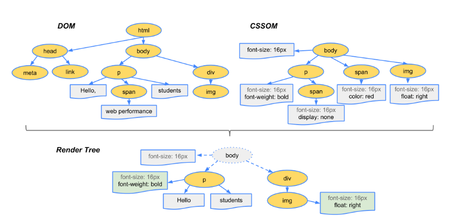

# 2022-08-31 수요일

----

# 주제 web & HTTP 

## WEB의 동작과정 

**클라이언트가 서버에 요청을 보내면 서버는 해당 요청에 대해 응답한다**

1. 웹 클라이언트(Web client)   
   필요한 데이터를 웹 서버에 요청하는 주체.

2. 웹 브라우저(Web Browser)  
   클라이언트의 요청을 받아서 Request Message를 작성, 웹 서버에 전달하고  
   웹 서버로부터 응답받은 Response Message를 해석하여 사용자에게 보여주는 소프트웨어  
   EX) Internet Exploler, FireFox, Chrome , Safari

3. HTTP(Hyper Text Transfer Protocol)  
- 웹 상에서 정보를 주고 받을 수 있는 프로토콜(규약, 언어)
- Hyper Text를 전달하기 위해 만들어진 프로토콜
- TCP Port: 80번 또는 HTTPS일 경우 Port:443번 사용
- Text 기반으로 이루어져있으며, Binary 형태가 아니다.
- OSI 7 Layer의 L7에 해당(application)
- 암호화 되지않은 평문을 전송 , sniffing에 취약
- TCP를 사용하지만 연결지향적 성격이 아니다.
  (서버와 계속 세션을 맺고 있는게 아니라, 원하는 정보를 받으면 세션 종료)

+@ 스니핑  
네트워크 트래픽을 도청하는 과정을 스니핑이라한다.  
일반적으로 작동하는 IP 필터링과 MAC 주소 필터링을 수행하지 않고,  
랜 카드로 들어오는 전기 신호를 모두 읽어
정보를 유출시키는 것을 의미한다.

4. 웹 서버(Web Server)
- 클라이언트의 요청에 따라 HTML 문서를 클라이언트에게 제공해주는 주체.

5. 웹 어플리케이션(Web Application)
- Browser를 통해 접근할 수 있는 응용프로그램
- HTTP에서 동작되는 프로그램

웹 동작 순서

① 사용자가 웹 브라우저의 검색창에 특정 사이트의 주소를 입력한다.

=> ② 웹 브라우저가 DNS에게 특정 사이트의 (도메인)주소를 요청한다.

=> ③ DNS가 웹 브라우저에게 사이트의 IP주소를 응답한다.

=> ④ 웹 브라우저가 웹 서버에게 IP 주소를 이용하여 html 문서를 요청한다.

=> ⑤ 웹 서버는 바로 웹 페이지를 공급하지 못하고, 웹 애플리케이션 서버(WAS)와 데이터 베이스에서 웹 페이지 작업을 처리한다.

=> ⑥ 작업 처리 결과를 웹 서버로 보낸다.

=> ⑦ 웹 서버는 웹 브라우저에게 html 문서 결과를 응답한다.

=> ⑧ 웹 브라우저는 화면에 웹 페이지를 출력한다.

+@ DNS ?

사람이 읽을 수 있는 도메인 이름을 IP 주소로 변환하는 시스템. => DNS 

DNS 구성 요소

1. 도메인 네임 스페이스(Domain Name Space)
2. 네임 서버(Name Server) = 권한 있는 DNS 서버
3. 리졸버(Resolver) = 권한 없는 DNS 서버

+@ 브라우저 랜더링 과정

랜더링이란, 
HTML,CSS ,JS등 개발자가 작성한 문서가 브라우저에서 출력되는 과정을 말한다. 
브라우저마다 랜더링을 수행하는 엔진을 가지고 있다. 
EX) 크롬 - 블링크, 사파리 - 웹킷 , 파이어폭스 - 개코

랜더링 과정

USER가 브라우저를 통해 접속하면 
서버로부터 HTML, CSS등 웹 구성 리소스를 다운로드 받는다. 
브라우저가 페이지를 랜더링 하려면, HTML 코드는 DOM, CSS는 CSSOM 트리를 생성한다.

1. DOM 트리 생성

1) 변환 : 브라우저가 HTML의 원시 바이트를 읽어와서, HTML에 정의된 인코딩(예: UTF-8)에 따라 개별 문자로 변환합니다.
2) 토큰화 : 브라우저가 문자열을 W3C 표준에 지정된 고유 토큰으로 변환합니다.
3) 렉싱 : 방출된 토큰은 해당 속성 및 규칙을 정의하는 “객체”로 변환됩니다.
4) DOM 생성 : 마지막으로 HTML 마크업에 정의된 여러 태그 간의 관계를 해석해서 트리 구조로 연결이 됩니다.

브라우저는 HTML 마크업을 처리 할 때 마다 위의 모든 단계를 수행한다.

2. CSSOM 트리 생성 

HTML 마크업 내에 직접 선언하거나,  
HEAD 태그에 외부 CSS파일을 참조하거나 STYLE 태그를 정의할 수 있다. 
작성된 스타일을 브라우저가 이해하고 처리할 수 있는 형식으로 변환과정을 거쳐야한다.

DOM트리 생성과 동일 과정을 진행한다.

3. 랜더링 트리의 완성

페이지 구성에 필요한 노드들만 포함한다.

4. 레이아웃 단계 
각 요소의 정확한 위치와 크기를 정확하게 캡처하는 BOX 모델이 출력된다.

5. 페인팅 단계

렌더링 트리의 각 노드를 화면의 실제 픽셀에 맞게 변환한다.

6. 리플로우(Reflow), 리페인트(Repaint)

사용자가 웹 페이지에 처음 접속하면, 렌더링과정을 거쳐서 화면에 모든 요소가 그려지게 된다.  
다양한 액션 수행후 이벤트로 인해 새로운 html 요소 추가나 스타일의 변경이 일어난다면, 
다시 한 번 트리 생성과 레이아웃 과정을 수핸한다. 
=> 리 플로우.

ex) 리플로우가 일어나는 대표 속성 
position, width, height, margin, padding, border, border-width, font-size, font-weight, line-height, text-align, overflow

ex) 리 페인트만 일어나는 대표 속성 
background, color, text-decoration, border-style, border-radius

# 참고 
https://medium.com/%EA%B0%9C%EB%B0%9C%EC%9E%90%EC%9D%98%ED%92%88%EA%B2%A9/%EB%B8%8C%EB%9D%BC%EC%9A%B0%EC%A0%80%EC%9D%98-%EB%A0%8C%EB%8D%94%EB%A7%81-%EA%B3%BC%EC%A0%95-5c01c4158ce