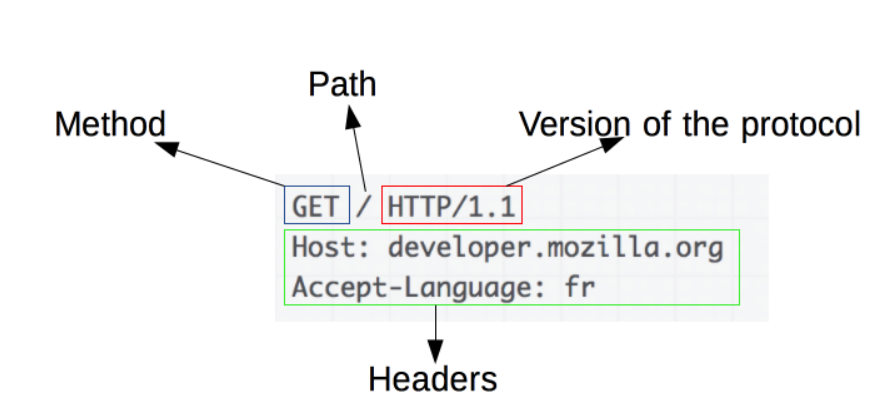

# 2022-08-31 수요일

----

# 주제 web & HTTP 

- HTTP VS HTTPS, 
- TLS VS SSL, 
- 대칭키 VS 비대칭키

## HTTP VS HTTPS

### HTTP의 구조

Method, Path, Version, Body등으로 구성한다.
평문으로 데이터를 전송하므로, 제 3자가 정보를 조회할 가능성이 생겼다.

### HTTPS(Hyper Text Transfer Protocol Secure)

- HTTP에 데이터 암호화가 추가된 프로토콜이다.
- 443번 포트를 사용하며, 네트워크 상에서 중간에 제3자가 정보를 볼 수 없도록 암호화를 지원하고 있다.

### HTTPS의 동작과정

- HTTPS는 대칭키 암호화와 비대칭키 암호화를 모두 사용하여 빠른 연산 속도와 안정성을 모두 얻고 있다.

1. 클라이언트(브라우저)가 서버로 최초 연결 시도를 한다.
2. 서버는 공개키(엄밀히는 인증서)를 브라우저에게 넘겨줌
3. 브라우저는 인증서의 유효성을 검사하고 세션키를 발급함
4. 브라우저는 세션키를 보관하며 추가로 서버의 공개키로 세션키를 암호화하여 서버로 전송함
5. 서버는 개인키로 암호화된 세션키를 복호화하여 세션키를 얻음
6. 클라이언트와 서버는 동일한 세션키를 공유하므로 데이터를 전달할 때 세션키로 암호화/복호화를 진행함  
=> 세션키는 주고받는 데이터를 암호화하기 위한 대칭키 

## HTTP VS HTTPS

- HTTP는 암호화가 추가되지 않았기 때문에 보안에 취약한 반면, HTTPS는 안전하게 데이터를 주고받을 수 있다.

- HTTPS를 이용하면 암호화/복호화의 과정이 필요하기 때문에 HTTP보다 속도가 느리다.

- HTTPS는 인증서를 발급하고 유지하기 위한 추가 비용이 발생하다.

- 개인 정보와 같은 민감한 데이터를 주고 받아야 한다면 HTTPS를 이용해야 하지만, 노출이 되어도 괜찮은 단순한 정보 조회 등 만을 처리하고 있다면 HTTP를 이용하면 된다.
## TLS VS SSL

1. SSL이란

SSL(Secure Sockets Layer)은 암호화 기반 인터넷 보안 프로토콜. 인터넷 통신의 개인정보 보호, 인증, 데이터 무결성을 보장한다.  
SSL/TLS를 적용한 웹 사이트는 HTTPS 통신을 함

2. SSL/TLS 작동

- 웹에서 전송되는 데이터를 암호화함.
- 두 통신 장치 사이에 핸드셰이크 라는 인증 프로세스를 시작하여 두 장치의 ID를 확인함.
- 데이터의 무결성을 보장하기 위해 데이터에 디지털 서명을 함

3. SSL vs TLS

- SSL은 TLS(Transport Layer Security)라는 또 다른 프로토콜의 이전 버전이다.
- SSL의 이름이 TLS로 바뀐 것일 뿐이다.
- SSL의 최종버전(3.0)과 TLS 첫 버전이라고 봐도 된다.
- SSL와 TLS가 같은 것이기 떄문에 혼용해서 SSL/TLS 라고 부른다.

4. SSL/TLS 핸드셰이크
   
- 핸드셰이크는 클라이언트와 서버간의 메세지 교환이며,  HTTPS 웹에 처음 커넥션할 때 진행된다.

- 핸드셰이크의 단계는 클라이언트와 서버에서 지원하는 암호화 알고리즘, 키 교환 알고리즘에 따라 달라진다.

일반적으로 RSA 키교환 알고리즘으로 사용된다.

RSA 키 교환 알고리즘 순서

1) 클라이언트 -> 서버 메세지 전송 - 이때 핸드셰이크가 시작된다. 이 메세지에는 TLS 버전, 암호화 알고리즘, 무작위 바이트 문자열이 포함된다. 
2) 서버 -> 클라이언트 메세지 전송 - 클라이언트의 메세지에 응답으로 서버의 SSL인증서, 선택한 암호화 알고리즘, 서버에서 생성한 무작위 바이트 문자열을 포함한 메세지를 전송한다. 
3) 인증 - 클라이언트가 서버의 SSL인증서를 인증 발행 기관에 검증한다. 
4) 예비 마스터 암호 - 클라이언트는 무작위 바이트 문자열을 공개 키로 암호화된 premater secret 키를 서버로 전송한다.
5) 개인 키 사용 - 서버가 premaster secret 키를 개인 키를 통해 복호화한다. (개인 키로만 복호화 가능)
6) 세션 키 생성 - 클라이언트와 서버는 클라이언트가 생성한 무작위 키, 서버가 생성한 무작위 키, premaster secret 키를 통해 세션 키를 생성한다. 양쪽은 같은 키가 생성되어야 한다.
7) 클라이언트 완료 전송 - 클라이언트는 세션 키로 암호화된 완료 메세지를 전송한다.
8) 서버 완료 전송 - 서버도 세션 키로 암호화된 완료 메세지를 전송한다.
9) 핸드셰이크 완료 - 핸드셰이크가 완료되고, 세션 키를 이용해 통신을 진행한다.

## 대칭키 VS 비대칭키 

대칭키 암호화 방식 : 암복호화에 사용하는 키가 동일함  
공개키 암호화 방식 : 암복호화에 사용하는 키가 서로 다르며 비대칭키 암호화라고도 함

### 대칭키

- 장점 : 암호화방식에 속도가 빠르다. 대용량 Data 암호화에 적합하다.
- 단점 : 키를 교환해야 하는 문제, 탈취 관리 걱정, 사람이 증가할수록 키관리가 어려워짐, 확장성 떨어짐
Session Key, Secret Key, Shared Key, 대칭키, 단용키라고도 함
- 기밀성을 제공하나, 무결성/인증/부인방지 를 보장하지 않음
- 대표적 알고리즘 : 공인인증서의 암호화방식으로 유명한 SEED, DES, 3DES, AES, ARIA, 최근 주목받고 있는 암호인 ChaCha20

### 비대칭키 

- 단점 : 속도가 느림
- 장점 : 키분배 필요 X, 기밀성/인증/부인방지 기능 제공
방식
- 암호 모드 : 송신자 공개키로 암호화 -> 송신자 사설키로 복호화
- 소량의 메시지 암호화 목적, 주로 키 교환의 용도로 사용
- 인증 모드 : 송신자 사설키로 암호화 -> 송신자 공개키로 복호화
메시지를 인증(부인방지)하는 것이 목적

대표적인 알고리즘

ex) 
Diffie Hellman : 최초의 공개키 알고리즘, 위조에 취약 
RSA : 대표적 공개키 알고리즘 
DSA : 전자서명 알고리즘 표준 
ECC : 짧은 키로 높은 암호 강도, 빠른 구현 가능 PDA, 스마트폰등에 사용

## 참고

https://mangkyu.tistory.com/98

https://kanoos-stu.tistory.com/46